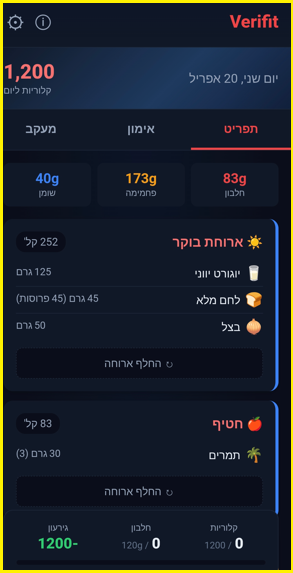
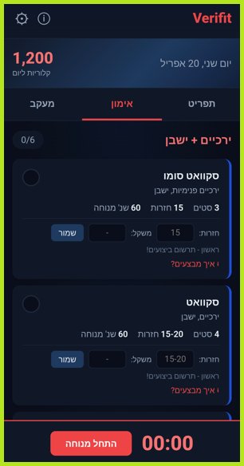
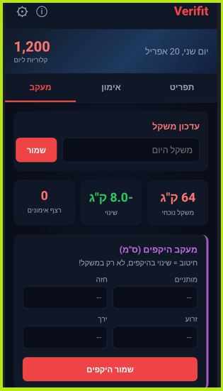

# Verifit

**Personalized fitness & nutrition planner — built as a Progressive Web App (PWA)**

Verifit generates a fully customized daily plan based on personal profile, food preferences, and available equipment. Designed for real daily use, it combines smart meal planning with structured workout tracking and long-term body progress monitoring.

---

## Features

### Personalized Nutrition Plan
- Daily calorie target calculated from personal profile (age, gender, height, weight, goal weight, activity level)
- Full macro breakdown per day: protein, carbs, fat
- Meals structured by type: breakfast, snack, lunch, dinner
- Each meal shows exact food items, portions (grams), and calorie count
- **Swap meal** option to replace any meal while keeping the plan balanced
- Manual food logging with search and free-entry options

### Smart Food Preferences
- Select favorite foods to prioritize in meal plans
- Exclude foods you dislike — the plan adapts automatically
- Supports a wide range of local and common foods

### Workout Planner
- Structured training sessions by muscle group
- Each exercise includes: sets, reps, rest time, and weight input
- Built-in rest timer
- Exercise form guide ("How to perform?")
- Adapts available exercises based on selected equipment (dumbbells, resistance bands, pull-up bar, mat)

### Body Progress Tracking
- Daily weight log with trend graph over time
- Body measurements: waist, chest, arm, thigh
- Visual progress indicators (current weight, change from start, workout streak)

---

## Tech Stack

| Layer | Technology |
|-------|-----------|
| Frontend | Vanilla JavaScript, HTML5, CSS3 |
| App Model | Progressive Web App (PWA) |
| Data Storage | Local (on-device, no server required) |
| Platform | Mobile-first, installable on Android & iOS |

---

## Screenshots

<p align="center">
  
  
  
  
</p>

---

## Installation

Verifit is a PWA — no app store needed.

1. Open the app URL in Chrome (Android) or Safari (iOS)
2. Tap **"Add to Home Screen"**
3. The app installs and works offline

---

## Architecture

```
Verifit/
├── index.html          # Main app shell
├── style.css           # UI styling (dark theme, mobile-first)
├── app.js              # Core application logic
├── sw.js               # Service Worker for offline support
├── manifest.json       # PWA manifest
└── assets/             # Icons, images
```

---

## Status

Currently in active use. Developed as a personal product — not a tutorial or demo project.

---

## Author

**Amit Rubin**
ERP & AI Operations Lead | 20 years in enterprise software
